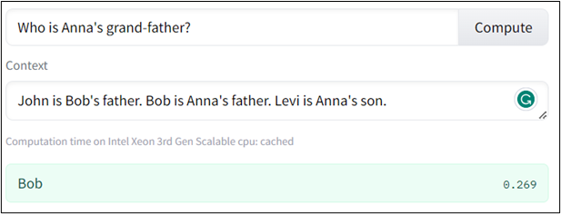
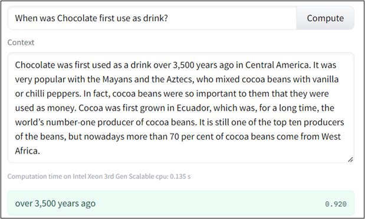
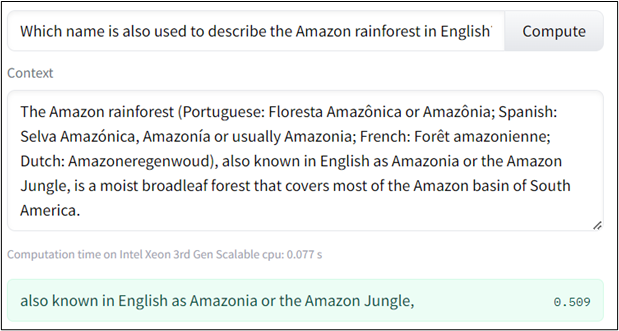
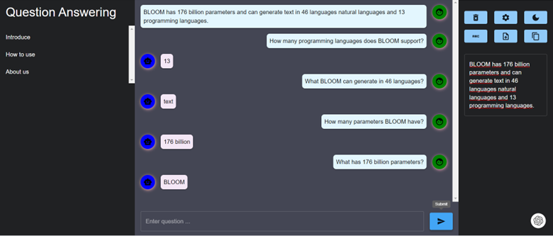
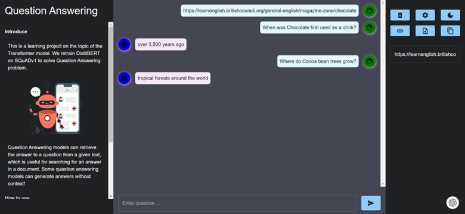

# Question Answering with DistilBERT

## Overview

This project explores the powerful capabilities of Transformer-based models in the field of Natural Language Processing (NLP), specifically focusing on the Question Answering (QA) task. Leveraging the DistilBERT model, a lightweight version of BERT, I aim to build and evaluate a QA system that answers questions based on provided contexts.

## Key Features
- Fine-tuning DistilBERT on the SQuAD dataset.
- Evaluating the model using Exact Match (EM) and F1-score metrics.
- Developing a demo web application using Flask and ReactJS.

## Problem Description

Question Answering (QA) involves developing models that can understand a context and provide accurate answers to questions based on that context. This task is essential for building systems that can automatically retrieve and present information from large text corpora.

## Transformer Architecture

Transformers leverage self-attention mechanisms to weigh the importance of each word in a sequence relative to the others. This architecture consists of:

- **Encoder**: Processes input sequences and generates contextual representations.
- **Decoder**: Generates output sequences based on the encoder's representations.
- **Attention Mechanism**: Computes attention scores to focus on different parts of the input sequence for each word.

## Experiments and Results
### Dataset

The dataset used is the SQuAD v1.1 (Stanford Question Answering Dataset), which includes questions and answers derived from Wikipedia articles.

**Data Split**:
- Training: 78,535 samples
- Validation: 9,817 samples
- Test: 9,817 samples

The data is preprocessed into context-question pairs for training, with each pair representing a specific question about a given context.

### Metrics

The model’s performance is evaluated using:

- **Exact Match (EM)**: Measures the percentage of predictions that exactly match any of the ground-truth answers. It is defined as:
  
  \[
  \text{EM} = \frac{\text{Number of exact matches}}{\text{Total number of samples}}
  \]

- **F1-Score**: Evaluates the model’s precision and recall. It is calculated as:

  \[
  \text{F1-score} = \frac{2 \times \text{Precision} \times \text{Recall}}{\text{Precision} + \text{Recall}}
  \]

  Where:

  \[
  \text{Precision} = \frac{\text{True Positives}}{\text{True Positives} + \text{False Positives}}
  \]

  \[
  \text{Recall} = \frac{\text{True Positives}}{\text{True Positives} + \text{False Negatives}}
  \]

### Results

#### Quantitative Analysis

The performance of the fine-tuned DistilBERT model is compared to several state-of-the-art models in the table below. This comparison highlights how DistilBERT performs relative to other models and provides context for its effectiveness in the QA task.

| Model                         | EM   | F1   |
|-------------------------------|------|------|
| **Human Performance** (Rajpurkar & Jia et al. ‘18) | 86.8 | 89.5 |
| **LUKE** (Ikuya Yamada & Akari Asai et al.) | 90.2 | 95.4 |
| **BERT+MT**                    | 86.5 | 92.6 |
| **Fine-tuned DistilBERT (Ours)**      | 69   | 81.8 |

The results reflect the trade-offs between model complexity and performance. DistilBERT, being a more lightweight model, provides a good balance of efficiency and performance, though it does not match the performance of larger, more complex models.

#### Qualitative Analysis

Although the measurement results are not high, the model still answers quite accurately. Here are a few examples:




In some cases, the answer is a bit unnatural:




## Demo

A web application has been developed to demonstrate the model's capabilities. The application uses Flask for the backend and ReactJS for the frontend.

### Installation

To get started with this project, follow these steps:

1. **Clone the Repository**:

    ```bash
    git clone https://github.com/Phongle1311/Question_Answering
    ```

2. **Set Up the Backend**:

    Navigate to the `backend` directory and install the required Python packages:

    ```bash
    cd backend
    pip install -r requirements.txt
    flask run
    ```

3. **Set Up the Frontend**:

    Open a new terminal, navigate to the `frontend` directory, and start the ReactJS application:

    ```bash
    cd frontend
    npm install
    npm start
    ```

### Features and Usage

- **Context and Question Input**: Enter your context and question directly into the input fields.
- **File Upload**: Upload a `.txt` file to use its contents as the context.
- **URL Mode**: Input a URL to extract context from a web page.
- **Additional Features**: Light/dark mode, clear current session, etc.

### Screenshots

- Context as raw text:

- Context as a URL [example](https://learnenglish.britishcouncil.org/general-english/magazine-zone/chocolate):

